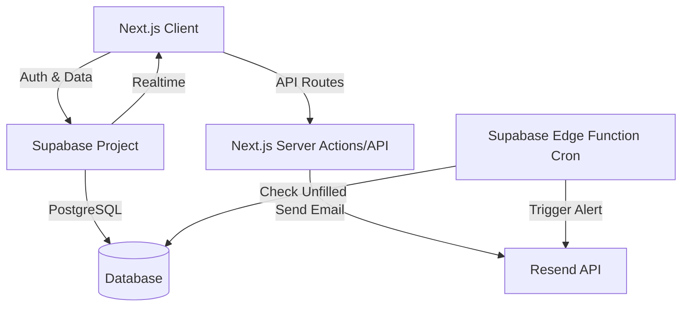

# VolunTy - Technical Design Document

## 1. High-Level Architectural Plan

### Tech Stack
- **Frontend Framework:** Next.js 14+ (App Router) with TypeScript.
  - **Styling:** Tailwind CSS.
  - **UI Components:** Shadcn/UI (Radix UI based) for accessible, modern components.
  - **Calendar Library:** `@fullcalendar/react` or `react-big-calendar` for the complex scheduling interface.
  - **State Management:** TanStack Query (React Query) for server state management and caching.
  - **Forms:** React Hook Form + Zod for validation.

- **Backend-as-a-Service (BaaS):** Supabase.
  - **Database:** PostgreSQL.
  - **Authentication:** Supabase Auth (Email/Password, Magic Links).
  - **Real-time:** Supabase Realtime subscriptions for live updates (e.g., when a shift is taken).
  - **Edge Functions:** For complex logic like "Escalation Alerts" cron jobs (checking 48h unfilled slots).

- **Notifications:**
  - **Email:** Resend (via Supabase Edge Functions or Next.js API routes).
  - **Push:** Web Push API + Service Workers.

### Architecture Diagram (Conceptual)

## 2. Database Schema

### Core Tables

#### `profiles`
Extends the default Supabase `auth.users` table.
- `id` (UUID, PK, FK to auth.users)
- `full_name` (Text)
- `role` (Enum: 'admin', 'volunteer')
- `phone_number` (Text)
- `created_at` (Timestamp)

#### `events`
The main container for a day's activity or a specific event.
- `id` (UUID, PK)
- `title` (Text)
- `description` (Text)
- `start_time` (Timestamptz)
- `end_time` (Timestamptz)
- `location` (Text)
- `is_published` (Boolean) - Draft mode for admins.

#### `sub_shifts`
Specific roles within an event (e.g., "Bar" from 12:00-14:00).
- `id` (UUID, PK)
- `event_id` (UUID, FK to events)
- `role_name` (Text) - e.g., "Bar", "Ticket Check"
- `start_time` (Timestamptz)
- `end_time` (Timestamptz)
- `capacity` (Int) - Max number of volunteers needed.
- `min_needed` (Int) - Critical threshold for alerts.

#### `shift_assignments`
Links a volunteer to a specific sub-shift.
- `id` (UUID, PK)
- `sub_shift_id` (UUID, FK to sub_shifts)
- `user_id` (UUID, FK to profiles)
- `status` (Enum: 'confirmed', 'pending_swap', 'completed', 'no_show')
- `checked_in_at` (Timestamptz, Nullable)

#### `swap_requests`
Handles the logic for shift trading.
- `id` (UUID, PK)
- `assignment_id` (UUID, FK to shift_assignments) - The shift being offered.
- `requester_id` (UUID, FK to profiles) - Original owner.
- `status` (Enum: 'open', 'accepted', 'cancelled')
- `accepted_by_id` (UUID, FK to profiles, Nullable)

#### `audit_logs`
For administrative review and accountability.
- `id` (UUID, PK)
- `action` (Text) - e.g., "SHIFT_SIGNUP", "SWAP_ACCEPTED", "EVENT_CREATED"
- `performed_by` (UUID, FK to profiles)
- `target_resource` (Text) - e.g., "shift_assignments"
- `target_id` (UUID)
- `details` (JSONB) - Snapshot of changes.
- `created_at` (Timestamptz)

## 3. UI Mockup Description: Admin Calendar

### Layout
- **Sidebar:** Navigation links (Dashboard, Calendar, Volunteers, Requests, Settings).
- **Main Area:** The interactive calendar component.

### Calendar Interface
- **Header:**
  - **View Switcher:** Buttons for "Month", "Week", "Day", "List".
  - **Date Navigation:** "< Prev", "Today", "Next >".
  - **Filters:** Filter by Event Type or Role (e.g., show only "Bar" shifts).
  - **Action:** Primary "Create Event" button.

- **Grid View (Month/Week):**
  - **Event Cards:** Displayed as colored blocks spanning their duration.
  - **Card Content:**
    - Event Title (e.g., "Summer Festival").
    - Time range.
    - **Staffing Indicator:** A small progress bar or badge (e.g., "12/20 filled").
    - **Alert State:** If the event is < 48h away and staffing is < `min_needed`, the card has a pulsing red border or warning icon.

- **Drag-and-Drop:**
  - Admins can drag an event card to a new day/time.
  - **Interaction:** On drop, a confirmation modal appears: "Move 'Summer Festival' to July 15th? This will notify 12 assigned volunteers."

### Event Creation/Edit Modal (The "Sub-shift" Builder)
- **General Info:** Title, Date, Time, Location.
- **Sub-shifts Section:**
  - A dynamic list where admins can add roles.
  - **Row:** [Role Name Input] | [Start Time] - [End Time] | [Capacity Input] | [Delete Btn]
  - **Example:**
    - Row 1: "Setup" | 10:00 - 12:00 | Cap: 4
    - Row 2: "Bar Shift 1" | 12:00 - 14:00 | Cap: 2
    - Row 3: "Bar Shift 2" | 14:00 - 16:00 | Cap: 2
- **Visual Timeline:** A mini Gantt chart below the inputs showing how the sub-shifts overlap within the main event duration.

### Volunteer Portal (Brief)
- **Mobile-First Card View:** Instead of a complex calendar, volunteers see a list of "Upcoming Opportunities" sorted by date.
- **Action:** "Sign Up" button changes to "Request Swap" if already signed up.
